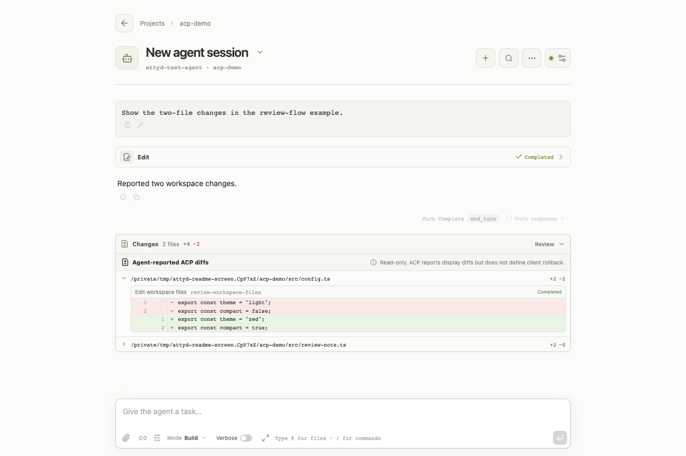

# attyd

**Your ACP agent, in the browser.**

attyd is a lightweight web client for the [Agent Client Protocol (ACP)](https://agentclientprotocol.com/).
Connect a local or remote coding agent and follow conversations, tool activity, and file changes
from desktop or mobile. Its focus is a simple Web ACP client, not a Web IDE: the agent handles
the coding; attyd gives you a clear place to interact with it.



## In the workspace

- **Projects and sessions.** Group conversations by working directory, switch between sessions, and open them through direct links.
- **Tools and changes.** Follow replies as they arrive, inspect tool output, and review reported file diffs alongside each turn.
- **Permissions and follow-ups.** Respond to approval requests, answer questions, ask the agent to stop, or queue your next message.
- **Context and search.** Attach files and images, mention workspace files with `@`, search a conversation, and export it as Markdown.

Models and sign-in stay with your agent. Features such as attachments and saved sessions
depend on its [ACP capabilities](docs/acp-coverage.md).
The interface supports English and 简体中文, follows your browser by default, and lets you
switch languages in Interface settings, alongside light, dark, and system themes.
[Contribute another language](docs/i18n.md).

## Get started

Install and configure an ACP-compatible agent, then choose **one** launch method below.
Replace `your-agent acp` with its actual command and arguments. For an existing remote service,
see [remote agent connections](docs/usage.md#remote-agents).

After starting attyd, open **http://127.0.0.1:7331**. Choose **New project** and enter a working
directory to start a conversation, or open an existing project to browse its sessions.

### Run from source

Building attyd requires both the Rust and Node.js toolchains:

- **Rust 1.88+ with Cargo** — install using [rustup](https://rust-lang.org/tools/install/).
- **Node.js 22 LTS (22.12+) or 24 LTS, with npm** — [install Node.js](https://nodejs.org/en/download).
- **Git and native build tools** — see [platform setup](docs/usage.md#build-prerequisites) for Linux, macOS, and Windows.

```bash
git clone https://github.com/tf4fun/attyd.git
cd attyd
npm ci
npm run dev -- -- your-agent acp
```

The first run compiles the web interface and Rust host, then starts the server.

### Run a compiled executable

Download an archive for your platform from [GitHub Releases](https://github.com/tf4fun/attyd/releases),
extract it, and run:

```bash
./attyd -- your-agent acp
```

On Windows, use `.\attyd.exe` in place of `./attyd`.
The executable includes the web interface and needs neither Rust nor Node.js at runtime.
Your agent may have its own dependencies. See [release binaries](docs/usage.md#release-binaries)
or [build your own executable](docs/usage.md#standalone-build).

### Example: Goose

[Install the Goose CLI](https://goose-docs.ai/docs/getting-started/installation/), then configure
its model provider and launch it through attyd:

```bash
goose configure
./attyd -- goose acp
```

From a source checkout, use `npm run dev -- -- goose acp` instead of the second command.
Goose is an optional backend; any compatible ACP agent can be used.
See [Goose's ACP guide](https://goose-docs.ai/docs/gdk/acp/) and the
[remote Goose example](docs/usage.md#optional-example-goose) for other connection options.

## History and access

attyd keeps conversation state in memory. Restarting attyd clears that state;
restoring earlier messages depends on history your agent can provide.

attyd is a single-user service that listens on localhost by default and has no application login.
Agent sign-in does not protect access to the web interface. The agent can read files and run commands;
use access control such as an authenticated reverse proxy before exposing attyd remotely.
See [deployment guidance](docs/usage.md#deployment-and-trust-boundaries).

## Documentation

- [Usage](docs/usage.md) — installation, configuration, remote connections, and agent examples.
- [ACP compatibility](docs/acp-coverage.md) — supported features and protocol boundaries.
- [Contributor guide](AGENTS.md), [tests](docs/testing.md), and [architecture](docs/active-turn-runtime.md) — development and verification.
- [Security policy](SECURITY.md) — reporting vulnerabilities and support scope.

Licensed under [Apache-2.0](LICENSE).
