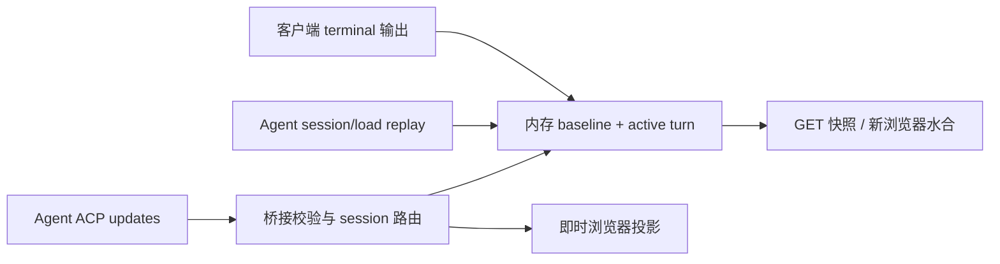

# ACP 开源前实现审查：规范、Zed 与 attyd

审查日期：2026-09-08。本文审查协议实现与产品行为，不修改运行逻辑。结论对应下列固定代码版本。

后续处置见 [差异分类与处置](acp-difference-decisions.md)：明确划分架构不支持、待讨论权衡和直接修复的缺陷。本文保留审查时的反例；其中 A18 在核对既有架构契约后已改归资源策略权衡，不再直接要求增加累计上限。修复后的当前状态以处置文档为准：本轮已修复 19 组明确缺陷，并完成完整回归与覆盖率验证。

## 1. 审查结论

**attyd 已具备通用 ACP Web 客户端的主要接口与交互基础，但当前不能把“接口已接通”表述为“完整且忠实地实现了 ACP v1”。建议先处理本报告的 P1 项，再作稳定首发。**

问题主要集中在四处：会话能力之间被增加了协议没有要求的依赖；会话工作目录没有贯穿客户端文件/终端服务；内存历史折叠与即时显示不等价；已经声明的可选能力仍存在边界错误。它们多数发生在同一进程、仍然存活的会话中，**不是不保存聊天历史的必然代价**。

现有工程基础值得保留：官方 SDK、能力门控、会话 incarnation 隔离、历史加载事务、同一发送意图的进程内去重、多浏览器共享运行态、标准工具卡片、权限/elicitation 生命周期、三种 Agent 传输模式，都已有实际实现和回归。本轮完整 Chromium 套件 57 项通过；额外探针仍找到了现有测试没有覆盖的反例。因此不能用通过数量或类型覆盖表代替语义验收。

**Zed 是参考实现，不是协议裁判。** 固定版本的 Zed 本身也有输出截断方向、版本协商、条件性终端认证分发和稀疏标题更新等差距。应学习其会话作用域、字段替换、取消展示、编辑器集成的组织方式，同时保留 attyd 更符合规范的行为。

### 1.1 版本与范围

| 对象 | 固定基准 |
| --- | --- |
| attyd | [`72745f3bd7b8bffbfac9f7e09d49fba421c6084a`](https://github.com/tf4fun/attyd/tree/72745f3bd7b8bffbfac9f7e09d49fba421c6084a) |
| Zed | [`ad51f6825c362d930c78a6579eecd21a06a7055d`](https://github.com/zed-industries/zed/tree/ad51f6825c362d930c78a6579eecd21a06a7055d)，提交时间 2026-09-07 17:16:20 UTC |
| 规范 | 审查日官方 [ACP v1 文档](https://agentclientprotocol.com/protocol/v1/schema)，各 RFD 按当日状态单独分类 |
| attyd Rust SDK | [`754d5aa1ce2cfa54ba2c2a6d3edc7e7b6bce28eb`](https://github.com/agentclientprotocol/rust-sdk/tree/754d5aa1ce2cfa54ba2c2a6d3edc7e7b6bce28eb)，schema `1.7.0`，启用 unstable 类型 |
| 测试用 TypeScript SDK | 锁定版本 `1.4.0`；它是独立协议测试端，不是生产桥接实现 |
| Zed schema | 固定提交的 Cargo.lock 使用 `1.5.0`；不能假定它具备 attyd SDK 中的所有新类型 |

按当前 SDK 方法表逐一清点：**42 个不同 wire 方法名**，其中本次 v1 稳定面为 25 个，另有 17 个扩展方法。按唯一方法名计数，双向使用的 `mcp/message` 只计一次；`$/cancel_request` 也是双向公共通知。稳定 `session/update` 有 11 个 variant，attyd 另外声明了 4 个计划/压缩草案 variant；标准内容块有 5 类。本报告逐项列出，不把“可选”误写成所有客户端都必须提供。

[ACP v2](https://agentclientprotocol.com/announcements/acp-v2-draft) 仍为草案，**不纳入本次 v1 发布的强制要求**。同样，SDK 已有类型不等于 RFD 已稳定；Zed 内置 Agent 的计划、沙箱、子 Agent、编辑器功能也不等于其外部 ACP 客户端实现了对应协议。

### 1.2 证据和差异归因

| 标记 | 含义 |
| --- | --- |
| 实测 | 用当前二进制与隔离 JSON-RPC Agent，或直接导入真实 Rust/TS 模块得到反例 |
| 静态 | 固定源码完整调用链；没有声称运行过该场景 |
| 规范差距 | 与明确的协议语义、能力门控或 MUST/SHOULD 条文比较；区分强制与建议 |
| 实现缺陷 | 现有功能给出错误结果、丢失输入语义或无法完成合法调用 |
| 产品范围 | 主动不提供编辑器、远程宿主机服务、运行中控制等；不自动等于 MUST 违规 |
| 无持久化边界 | 进程结束后没有客户端独有历史、终端快照、操作日志；恢复取决于 Agent |
| 扩展差异 | Draft 或厂商私有行为；不能算入稳定 ACP 必需能力 |

所有 Zed 结论均为固定源码审查，**没有编译或运行 Zed**。P1 表示建议稳定发布前修复，P2 表示应纳入互操作/完整度修复，P3 表示较低优先级的规范建议或展示一致性；这不是漏洞严重性评分。

## 2. Zed 与 ACP 标准的差距

本节先独立评价参考实现，避免后文把“和 Zed 不同”直接判成 attyd 错误。

| 编号 | Zed 行为与依据 | 对规范的判断 | attyd 应如何处理 |
| --- | --- | --- | --- |
| Z01 | 请求 v1 后，只判断响应版本是否小于最低版本；响应 2 也会通过这层检查。[版本检查](https://github.com/zed-industries/zed/blob/ad51f6825c362d930c78a6579eecd21a06a7055d/crates/agent_servers/src/acp.rs#L992) | [初始化规范](https://agentclientprotocol.com/protocol/v1/initialization)要求双方使用共同支持的版本；不支持时 SHOULD 关闭。此 v1 adapter 的上界检查不足，静态结论。 | attyd 精确检查响应为 1；探针返回 2 时正确停止。保留。 |
| Z02 | `truncated_output` 对字符串调用 `truncate(end_ix)`，保留开头、丢掉尾部。[源码](https://github.com/zed-industries/zed/blob/ad51f6825c362d930c78a6579eecd21a06a7055d/crates/acp_thread/src/terminal.rs#L560) | [terminal/output](https://agentclientprotocol.com/protocol/v1/terminals#getting-output)要求超限丢掉前部、保留尾部，并遵守字符边界。方向相反。 | attyd 保留尾部的方向正确；仅修 A14 的运行中 UTF-8 边界。 |
| Z03 | 项目 MCP 配置转换直接生成 `McpServer::Http`，new/load/resume 调用链未按 Agent `mcpCapabilities.http` 门控。[转换](https://github.com/zed-industries/zed/blob/ad51f6825c362d930c78a6579eecd21a06a7055d/crates/agent_servers/src/acp.rs#L4326) | 对“配置 HTTP MCP、Agent 未声明支持”这个条件，静态调用链会违反[先协商再使用](https://agentclientprotocol.com/protocol/v1/session-setup)。未运行 Zed 复现。 | attyd `validate_configured_capabilities` 已检查 HTTP/SSE/ACP MCP 能力，保留。 |
| Z04 | `auth.terminal=true` 无条件声明，但原生 Terminal 方法只在 `AcpBetaFeatureFlag` 开启时生成任务；对于不走 Gemini 特殊认证覆盖的 Agent，关旗且标准方法无旧 metadata 时，UI 最终发 `authenticate`。[能力](https://github.com/zed-industries/zed/blob/ad51f6825c362d930c78a6579eecd21a06a7055d/crates/agent_servers/src/acp.rs#L766)、[任务](https://github.com/zed-industries/zed/blob/ad51f6825c362d930c78a6579eecd21a06a7055d/crates/agent_servers/src/acp.rs#L1852)、[UI 调用](https://github.com/zed-industries/zed/blob/ad51f6825c362d930c78a6579eecd21a06a7055d/crates/agent_ui/src/conversation_view.rs#L1917) | 标准 [Terminal Authentication](https://agentclientprotocol.com/protocol/v1/authentication)应复现 Agent 启动命令，并在成功后建立新连接；不能把该方法当作 Agent-handled RPC。条件明确的静态缺陷，不代表所有 Zed 登录失败。 | attyd 的原生 terminal 路径、PTY、成功重连已实现，且远程不声明此能力；保留，不复制旧 metadata 依赖。 |
| Z05 | thread 的 session-info 处理仅匹配 `MaybeUndefined::Value(title)`，忽略显式 null。[源码](https://github.com/zed-industries/zed/blob/ad51f6825c362d930c78a6579eecd21a06a7055d/crates/acp_thread/src/acp_thread.rs#L2613) | [Session Info Update](https://agentclientprotocol.com/rfds/session-info-update)支持显式清空。原通知另发给 session list，本次不把结论扩展为列表也必然出错。 | attyd 即时 reducer 正确处理 null；修 A06 的快照丢字段时保留该语义。 |
| Z06 | audio 在 `block_string_contents` 没有对应处理，部分混合媒体退化为占位。[内容转换](https://github.com/zed-industries/zed/blob/ad51f6825c362d930c78a6579eecd21a06a7055d/crates/acp_thread/src/acp_thread.rs#L1423)、[字符串提取](https://github.com/zed-industries/zed/blob/ad51f6825c362d930c78a6579eecd21a06a7055d/crates/acp_thread/src/acp_thread.rs#L1680) | 标准类型被接收不等于 UI 完整呈现；未找到必须使用特定播放器的条文，不定为 wire 拒绝。 | attyd 已有 image/audio 控件，保留更完整的媒体展示。 |
| Z07 | 识别 `_meta` 中 terminal_info/output/exit、旧 terminal-auth；另对 Gemini 的特定取消异常文本转为 Cancelled。[通知兼容](https://github.com/zed-industries/zed/blob/ad51f6825c362d930c78a6579eecd21a06a7055d/crates/agent_servers/src/acp.rs#L4800)、[Gemini 取消](https://github.com/zed-industries/zed/blob/ad51f6825c362d930c78a6579eecd21a06a7055d/crates/agent_servers/src/acp.rs#L1940) | ACP 允许私有扩展。这些是生态兼容，不是标准字段或必须行为。 | 不解释 Goose/Zed 私有 metadata、不按厂商错误文本改写结果，符合本项目的标准优先定位。 |

另外，Zed 的 filesystem 通过编辑器 buffer 读取未保存内容、写入时可能格式化；terminal 通过项目环境和 PTY 执行。这些是编辑器产品能力。不能据此要求 attyd 建数据库、实现编辑器或复制 PTY 后台进程行为。

## 3. 初始化、认证、传输与协议基础

### 3.1 初始化与认证接口

规范依据：[Initialization](https://agentclientprotocol.com/protocol/v1/initialization)、[Authentication](https://agentclientprotocol.com/protocol/v1/authentication)。

| 接口 | ACP 要点 | Zed | attyd 与归因 |
| --- | --- | --- | --- |
| `initialize` | 建会话前协商版本、能力、认证方法；省略能力视为不支持 | v1 初始化；存在 Z01、Z04 | `src/bridge.rs:1941–1970,2404–2427`，版本精确检查，local/remote 能力区分正确；但验证器增加了 logout 与 authMethods 非空的依赖，A19。 |
| `authenticate` | 只选择 Agent 提供的方法；Agent-handled 与 terminal auth 分开 | 普通 RPC 可用；标准 terminal 路径存在条件性 Z04 | `bridge.rs:2943–2974` 检查方法 ID，不允许 terminal 方法走此 RPC；UI auth_required 可恢复。独立浏览器认证用例通过。 |
| `logout` | 独立 Agent `auth.logout` 能力；不规定已存在会话如何结束 | 按 logout capability 发送 | `bridge.rs:2976–2992` 门控正确；初始化对无 authMethods 的 Agent 过度拒绝，见 A19。成功后不凭空删除 Agent 会话，合理。 |

**Terminal Authentication 不是新增 wire 方法。** attyd 在 `src/auth_terminal.rs:76–100` 使用配置的 Agent executable/base argv，追加该方法 args、合入 env，在相同启动上下文开 PTY；零退出后 UI 重连并重新 initialize。输入/滚动输出只在内存。远程端无法复现远端启动命令，故不声明能力，是诚实的支持范围，和 Zed 的本地编辑器形态不同。

### 3.2 传输与 JSON-RPC

| 通道/机制 | 当前实现与验证 | 与标准、Zed 的关系 |
| --- | --- | --- |
| stdio | `src/agent_process.rs`；NDJSON，协议 stdout 与日志 stderr 分离，8MB 行上限、子进程退出/关闭处理；真实二进制及浏览器 fixture 覆盖 | [v1 指定的基线传输](https://agentclientprotocol.com/protocol/v1/transports)。Zed 外部 ACP 主路径同样启动本地 Agent。大小上限属于 attyd 资源策略，不是 ACP 数值要求。 |
| HTTP/SSE | `bridge.rs:1238–1254` 使用 pinned 官方 HTTP SDK；本轮 remote smoke 通过 | v1 transport 页面仍将 Streamable HTTP 标为 draft；[相关 RFD](https://agentclientprotocol.com/rfds/streamable-http-websocket-transport)处于 Active。应写“支持当前 SDK profile”，不能宣称所有远程实现已统一互通。 |
| WebSocket | 同一 SDK 的 WebSocket profile；本轮 remote smoke 通过 | v1 允许保持 JSON-RPC 格式与生命周期的自定义传输。当前 Zed 外部 adapter 未提供同样入口；不是 attyd 缺少对齐。 |
| 浏览器 REST/SSE | REST 操作、权威快照、SSE 增量由 attyd 自己定义；本轮 UI smoke 与 57 项 Chromium 通过 | **不是 Agent 侧 ACP transport**。If-Match、Idempotency-Key、revision、operationId 是桥接并发控制，不应作为 Agent 必须理解的 ACP 字段。 |
| `$/cancel_request` | 官方 SDK 接收取消信号；fs read、变更前 write、terminal wait、permission/elicitation、MCP connect/message 采用 RequestCancellation | [取消是可选机制](https://agentclientprotocol.com/protocol/v1/cancellation)，不是所有 handler 都必须中断。取消 wait 不等于 kill/release；session/cancel 是另一条生命周期操作。Zed 也在文件/终端/交互入口使用 SDK token。 |
| 未知自定义 request | 探针 `_audit/unknown` 返回 `-32601`，保留字符串 request ID | 符合 [Extensibility](https://agentclientprotocol.com/protocol/v1/extensibility)。 |
| 未知自定义 notification | 同一探针连接继续 ready，没有协议响应或业务中断 | 符合忽略未知自定义通知的要求；不等于所有未知标准 enum 都能无损透传。 |
| 错误与通知 | Agent error code/data 有界转发；通知不伪造成功 result | 部分客户端参数错误映射过宽，elicitation 未声明 mode 的错误码已实证为 A17。 |

远程模式不声明 attyd 宿主机 filesystem/terminal，是合理的能力范围。发现的跨系统路径错误 A22 发生在 Agent 路径参数校验，与是否提供宿主机文件服务是两件事。

## 4. 会话接口逐项审查

规范依据：[Session Setup](https://agentclientprotocol.com/protocol/v1/session-setup)、[Session List](https://agentclientprotocol.com/protocol/v1/session-list)、[Session Delete](https://agentclientprotocol.com/protocol/v1/session-delete)、[Prompt Turn](https://agentclientprotocol.com/protocol/v1/prompt-turn)、[Modes](https://agentclientprotocol.com/protocol/v1/session-modes)、[Config Options](https://agentclientprotocol.com/protocol/v1/session-config-options)。fork 单独按 [Draft](https://agentclientprotocol.com/rfds/session-fork)评价。

| 接口 | 规范要求/允许行为 | Zed 外部 ACP 实现 | attyd 差异与结论 |
| --- | --- | --- | --- |
| `session/new` | 绝对 cwd；MCP 和 additionalDirectories 按能力使用；返回独立 sessionId | 项目 cwd、MCP、协商后的额外根；HTTP MCP 有 Z03 | `bridge.rs:2993–3098`，早到通知缓冲、ID/响应校验、事务创建已实现。发送的 cwd 正确，但 fs/terminal 没有跟随，A01；远程 Windows 路径新建被拒绝，A22。 |
| `session/load` | 仅 loadSession=true 时调用；完整重放后响应；不要求支持 list | [load/open](https://github.com/zed-industries/zed/blob/ad51f6825c362d930c78a6579eecd21a06a7055d/crates/agent_servers/src/acp.rs#L1219)预注册 thread、合并同 ID pending load，不把 list 当硬前置 | `bridge.rs:2018–2079,3163–3463`；candidate 完成才替换历史，适合多浏览器。冷加载必须先有 listed_sessions，导致 load-only 已知 ID 无法恢复，A08。 |
| `session/resume` | 独立 resume 能力；响应前不重放历史；可以只有上下文、没有旧 transcript | [resume](https://github.com/zed-industries/zed/blob/ad51f6825c362d930c78a6579eecd21a06a7055d/crates/agent_servers/src/acp.rs#L1803)仅发 resume，不补 load | 内部 branch 有能力检查，成功后却强制 load，A07。REST/UI 无独立 resume 入口，A08；类型和内部分支不能算端到端完整支持。 |
| `session/list` | 独立能力；可选 cwd 与不透明 cursor；不应跨进程保存 cursor | [list](https://github.com/zed-industries/zed/blob/ad51f6825c362d930c78a6579eecd21a06a7055d/crates/agent_servers/src/acp.rs#L559)按每次请求转发 cursor/cwd | 已去掉启动 cwd 筛选，按 Agent cwd 分项目，符合产品需求。全局唯一 nextCursor 会让两个浏览器互相破坏分页，A09；前端无能力判断调用，A08。 |
| `session/close` | 可选；释放活动资源并取消进行中工作；不是删除历史 | [thread release](https://github.com/zed-industries/zed/blob/ad51f6825c362d930c78a6579eecd21a06a7055d/crates/agent_servers/src/acp.rs#L1165)协商后发送，不要求 prompt idle | `bridge.rs:3664–3735` idle close 成功清理 mirror、终端和交互，合理。运行中直接拒绝，A10；属于能力范围收缩，不能解释成 ACP 要求。 |
| `session/delete` | 可选；成功后不再被 list 返回；不存在时 SHOULD 静默成功；物理擦除不在承诺内 | [delete](https://github.com/zed-industries/zed/blob/ad51f6825c362d930c78a6579eecd21a06a7055d/crates/agent_servers/src/acp.rs#L600)成功后刷新，活动删除交 Agent 判断 | `bridge.rs:3737–3870` 可删除未列出 ID；活跃会话能 close 时先 close；部分失败保留已关闭事实。忙时不删是产品策略，不是无持久化必需。 |
| `session/prompt` | 按内容能力发送；原请求以 stopReason 结束 | [prompt](https://github.com/zed-industries/zed/blob/ad51f6825c362d930c78a6579eecd21a06a7055d/crates/agent_servers/src/acp.rs#L1917)标准 RPC，额外有 Gemini 兼容 Z07 | `bridge.rs:3871–4191` 同 session 串行、跨 session 并行、进程内意图去重。每轮观察结果提交到内存，不每轮 load，方向正确；历史保真受 A02–A06 影响。 |
| `session/cancel` | 通知；取消待决权限，继续接收结束前更新；原 prompt 返回 cancelled；SHOULD 本地终结未完成工具展示 | [cancel](https://github.com/zed-industries/zed/blob/ad51f6825c362d930c78a6579eecd21a06a7055d/crates/acp_thread/src/acp_thread.rs#L3901)清权限并将未完成工具显示为 Cancelled | `bridge.rs:4193–4226,5561` 取消与交互清理已接通，operation/revision 防误取消后续 turn；工具卡仍可能永久转圈，A11。 |
| `session/set_mode` | 选择 Agent 提供的 ID；允许生成期间切换 | [setter](https://github.com/zed-industries/zed/blob/ad51f6825c362d930c78a6579eecd21a06a7055d/crates/agent_servers/src/acp.rs#L4397)直接发、乐观更新/失败回滚 | `bridge.rs:4228–4351` 非乐观更新是合理 UI 选择；busy guard 阻止运行中切换，A10。 |
| `session/set_config_option` | select/协商后的 boolean；完整列表响应替换；可在生成期间切换 | [config](https://github.com/zed-industries/zed/blob/ad51f6825c362d930c78a6579eecd21a06a7055d/crates/agent_servers/src/acp.rs#L4378)完整替换，优先 configOptions | `bridge.rs:4352–4510` 类型/响应处理已实现；busy guard 同 A10，legacy modes 排他规则同 A21。 |
| `session/fork`（Draft） | 独立 fork 能力，新 ID，不隐含 loadSession | 固定外部 adapter 未实现此草案 RPC | `bridge.rs:3466–3662`、`server.rs:1582` 已有 UI/REST/Agent 链；源会话 idle/同 cwd 是范围选择。额外 load 会把已成功的 fork 变成用户侧失败，A07。 |

additionalDirectories、MCP 配置是生命周期参数，不是额外方法。attyd 静态配置的范围可以接受，但不能把启动根误当成所有 session 的主根。关闭后清内存是设计；加载依赖全局列表、恢复强制 load、分页互斥和运行中控制限制都不由该设计推出。

## 5. Agent → Client 服务逐接口审查

### 5.1 文件与终端

规范依据：[File System](https://agentclientprotocol.com/protocol/v1/file-system)、[Terminals](https://agentclientprotocol.com/protocol/v1/terminals)。attyd 仅在 stdio 声明这组宿主机服务。

| 接口 | ACP 要点 | Zed | attyd 差异与结论 |
| --- | --- | --- | --- |
| `fs/read_text_file` | sessionId、绝对 path、可选 1-based line/limit | 按 session → thread → Project 读 buffer，可包含未保存内容；[handler](https://github.com/zed-industries/zed/blob/ad51f6825c362d930c78a6579eecd21a06a7055d/crates/agent_servers/src/acp.rs#L4718) | `bridge.rs:1692`、`filesystem.rs:66–135`，范围/UTF-8/取消/边界已有实现。无编辑器 buffer 是产品差异；工作根未按 session 选择是 A01。拒绝 line=0 符合 1-based 定义，不必复制 Zed 的宽容。 |
| `fs/write_text_file` | 写完整 content；文件不存在则创建 | [buffer transaction](https://github.com/zed-industries/zed/blob/ad51f6825c362d930c78a6579eecd21a06a7055d/crates/acp_thread/src/acp_thread.rs#L4292)，可能 format-on-save | `filesystem.rs:137–178` 原地写、flush，父目录须存在；不做编辑器合并/格式化合理。变更前接受取消，开始后完成。A01 同样影响写入。规范未要求原子替换或递归建目录，不将这些差异误定为违规。 |
| `terminal/create` | 快速返回 ID，不等待命令结束；command/args/env/cwd/outputByteLimit | [外部 handler](https://github.com/zed-industries/zed/blob/ad51f6825c362d930c78a6579eecd21a06a7055d/crates/agent_servers/src/acp.rs#L4903)走 [create_terminal_entity](https://github.com/zed-industries/zed/blob/ad51f6825c362d930c78a6579eecd21a06a7055d/crates/acp_thread/src/terminal.rs#L615)，项目环境、默认 shell、PTY | `terminal.rs:127,479` spawn 后返回；Unix 非交互 /bin/sh、stdin null、pipes；非空 args 保持字面 argv。shell/PTY 差异是执行策略。显式 cwd=B 被拒绝、缺省落 A 为 A01。 |
| `terminal/output` | 立即返回已捕获内容、截断标记、可选退出状态；保留尾部且不拆字符 | Zed 截断方向错误 Z02 | `terminal.rs:184–196,345–353` 保留尾部正确；运行中半个 UTF-8 字符被 lossy 转换，可能超过 byte limit，A14。浏览器增量重组正确不能抵消 RPC 本身错误。 |
| `terminal/wait_for_exit` | 等待退出；取消等待不释放 ID | [handler](https://github.com/zed-industries/zed/blob/ad51f6825c362d930c78a6579eecd21a06a7055d/crates/agent_servers/src/acp.rs#L5041)可取消等待，共享任务保存输出 | `terminal.rs:199,362` 可取消而不杀进程；父命令退出后最多 drain 1 秒再发布 exitStatus。这个上限是 pipe 生命周期策略，关闭 reader 不冒充 byte-limit truncated。 |
| `terminal/kill` | 停止命令但保留 ID，之后可 output/wait，最终仍需 release | [kill](https://github.com/zed-industries/zed/blob/ad51f6825c362d930c78a6579eecd21a06a7055d/crates/acp_thread/src/acp_thread.rs#L4543)不移除 map | `terminal.rs:220` 保留 ID；运行中终止进程组，已退出时不补杀旧 PGID。响应不代表 OS 已完全退出，应继续 wait。正常退出/显式终止分开是合理策略。 |
| `terminal/release` | 终止仍运行命令并使 ID 失效；嵌入工具的输出 SHOULD 继续可见 | [release](https://github.com/zed-industries/zed/blob/ad51f6825c362d930c78a6579eecd21a06a7055d/crates/acp_thread/src/acp_thread.rs#L4558)移除 map，tool 实体保留显示 | `terminal.rs:237` 释放句柄；`session_mirror.rs:548` 独立保留被历史引用的输出，不改 Agent rawOutput。冷重启丢客户端输出可接受；运行期累计保留缺少预算是 A18。 |

**终端清理不是协议对所有后台进程的一条统一规则。** ACP 定义句柄、kill/release 和输出生命周期，没有规定必须 PTY、必须用户 shell，也没有规定父 shell 正常退出后所有 detached 子进程必然存活或必然销毁。Zed 的 PTY job control 和 attyd 的 pipe 进程组不同，不能只看信号代码推导同一 nohup 脚本一定相同。当前 attyd“正常退出放弃后台进程组管理；仍运行时显式终止清理”的规则应继续作为产品执行契约描述。

本地 4MB 文件上限、terminal 默认 200,000 bytes/硬上限 1,000,000 bytes、32 个 live terminal 等都是资源策略。`--read-only` 仅控制 ACP 文件写能力，不是禁用终端执行的 OS 沙箱；现有使用文档已经说明该边界。

### 5.2 权限与 elicitation

规范依据：[Tool permissions](https://agentclientprotocol.com/protocol/v1/tool-calls#requesting-permission)、[Elicitation](https://agentclientprotocol.com/protocol/v1/elicitation)。elicitation 在审查日已属于稳定 v1，不应再统一称为 beta。

| 接口 | ACP 要点 | Zed | attyd 差异与结论 |
| --- | --- | --- | --- |
| `session/request_permission` | 返回 Agent 给出的 optionId 或 cancelled；turn 取消时待决权限必须完成为 cancelled | [handler](https://github.com/zed-industries/zed/blob/ad51f6825c362d930c78a6579eecd21a06a7055d/crates/agent_servers/src/acp.rs#L4513)创建授权 UI，接收请求取消 | `bridge.rs:1325,4508,5561` 校验 session/选项/终端归属；重复请求不覆盖；响应事务避免双应答；turn cancel 与独立 RPC cancel 分开处理。未发现新的确定权限取消缺陷。 |
| `elicitation/create` | 显式声明 form/url；session 或 request 作用域；accept/decline/cancel；URL 同意前显示 Agent、host、完整 URL，不预取 | [作用域处理](https://github.com/zed-industries/zed/blob/ad51f6825c362d930c78a6579eecd21a06a7055d/crates/agent_servers/src/acp.rs#L4565)，独立 store 和 cancellation | 基本交互与作用域完整；URL consent 信息不足 A12、ID 生命周期过严 A13、Unicode 长度 A16、错误码 A17。这里不需要持久化任何认证凭据。 |
| `elicitation/complete` | notification；结束同连接对应 URL 流；未知/已完成 ID 忽略；accept 不等于外部流程完成 | [handler](https://github.com/zed-industries/zed/blob/ad51f6825c362d930c78a6579eecd21a06a7055d/crates/agent_servers/src/acp.rs#L4654)仅推进有效 Accepted entry | `bridge.rs:1634` settled/remove。未知 ID 内部返回 Error，但实测 SDK 对外忽略、连接继续正常；**不误报断连**。可改成显式 no-op 表达意图，实际互操作问题是 A13。 |

allow_always/reject_always 只是 Agent 提供的 option kind。attyd 转回原 optionId，而不自己建立永久授权数据库，属于合理范围；不能据“always”推导客户端必须落盘记忆规则。

## 6. session/update、内容和工具展示

### 6.1 全部稳定通知与已声明草案

共同源码入口：[Zed dispatch](https://github.com/zed-industries/zed/blob/ad51f6825c362d930c78a6579eecd21a06a7055d/crates/agent_servers/src/acp.rs#L4744)、[Zed thread](https://github.com/zed-industries/zed/blob/ad51f6825c362d930c78a6579eecd21a06a7055d/crates/acp_thread/src/acp_thread.rs#L2549)；attyd `src/bridge.rs:2428`、`src/semantic.rs:518`、`web/src/lib/state.ts:1541`。

| 方法/variant | 规范与 Zed | attyd 现状、差异 |
| --- | --- | --- |
| `session/update` 总入口 | 对活跃 session 接收通知；Zed 不要求当前存在本地 prompt turn | 对已物化且不处于 load/reconcile 的会话，conversation variant 在 active_turn=None 时被丢弃；工具定位也过度局限本 turn，A02。 |
| `user_message_chunk` | [Message ID](https://agentclientprotocol.com/rfds/message-id)稳定；Zed 匹配乐观 prompt 回显 | live 多块只去重首块，内存提交还会重复本地 prompt，A05；历史不同 messageId 合并为 A03。 |
| `agent_message_chunk` | Zed 按消息 ID、角色判断相邻合并 | live 基本正确；history cache 先删除 ID 再比较，A03。 |
| `agent_thought_chunk` | 独立 thought 类别，同样适用 ID；Zed 在 assistant entry 中保留顺序 | 默认折叠属于产品选择；历史同样受 A03 影响。不应拿 Goose 私有 metadata 替代标准 messageId。 |
| `tool_call` | toolCallId 作用域是 session；缺省 kind/status 有标准默认值 | 当前 turn 内找 ID；合法旧工具延迟更新受 A02 影响。卡片主路径已有标准类型分支。 |
| `tool_call_update` | 提供的字段更新；rawInput/rawOutput 没有定义 JSON deep patch。Zed [update_fields](https://github.com/zed-industries/zed/blob/ad51f6825c362d930c78a6579eecd21a06a7055d/crates/acp_thread/src/acp_thread.rs#L952)整字段赋值 | React 层字段替换正确，Rust 历史 fold 错误递归合并，A04。未知工具做可见失败占位与 Zed 相近，但不能把合法跨 turn 更新误当未知。 |
| `plan` | [稳定 plan](https://agentclientprotocol.com/protocol/v1/agent-plan)每次完整替换 entries；Zed 替换并在完成时留快照 | 完整替换与 composer 旁展示已实现。完成后 timeline snapshot 是产品规则；idle 更新仍受 A02 影响。 |
| `available_commands_update` | [Slash Commands](https://agentclientprotocol.com/protocol/v1/slash-commands)完整更新菜单，通过普通 prompt 发送 /name | 动态菜单/description/input hint 已实现，没有发明额外执行 RPC；该控制更新可在 idle 接收。 |
| `current_mode_update` | Agent 主动改 mode；Zed 更新连接与 thread 状态 | 控制状态可更新；用户主动修改受 A10 的 busy 限制。 |
| `config_option_update` | 完整替换列表；Zed 支持 select/boolean，config 存在时优先使用 | 类型/列表替换已有实现；legacy modes 排他建议未完整遵循，A21。 |
| `session_info_update` | [字段独立 patch](https://agentclientprotocol.com/rfds/session-info-update)，省略保留/null 清空；Zed thread 有 Z05 | 单条通知 reducer 正确，快照仅保存最后整条通知，先前 title 等丢失，A06。 |
| `usage_update` | [used/size 是当前上下文、cost 可选且累计](https://agentclientprotocol.com/rfds/session-usage)；Zed 缺 cost 时保留已有 cost | 单条通知 reducer 正确，快照丢先前 cost，A06；实际刷新可能立即走快照路径，不能据 reducer 正确推断页面正常。 |
| `plan_update`（Draft） | [Plan Operations](https://agentclientprotocol.com/rfds/plan-operations)按 ID 替换具体计划；Zed 未声明外部 ACP handler | 已声明 `clientCapabilities.plan`，按 planId 更新；SDK 用 planId，RFD prose 仍写 id，属于草案版本差异。 |
| `plan_removed`（Draft） | 删除指定计划；Zed 无对应外部 handler | live 有 removed 行，fold 删除同 ID 槽，最终删除状态一致；是否保留删除标记是显示策略。 |
| `compaction_update`（Draft） | [Session Compaction](https://agentclientprotocol.com/rfds/session-compaction)要求协商、固定实体位置、按字段 patch | 已声明 `session.compaction`；交错消息被拆在压缩卡两侧，A20。Zed 内置 compaction 不是此草案的实现依据。 |
| `compaction_summary_chunk`（Draft） | 有效压缩期间追加 summary，终态 summary 可替换累计内容 | ID/status 次序和追加已有验证；交错实体位置同 A20，idle 丢弃同 A02。 |

### 6.2 全部内容类型与工具字段

依据：[Content](https://agentclientprotocol.com/protocol/v1/content)、[Tool Calls](https://agentclientprotocol.com/protocol/v1/tool-calls)。展示布局并非协议规定，评价重点是必要信息、字段语义和历史保真。

| 类型/字段 | attyd 与 Zed 的差异 | 判断 |
| --- | --- | --- |
| `text` | Markdown 正文，title 保留；不增加虚构 Description。Zed 会按 execute/edit 等调整 title 文本处理 | 合理统一卡片策略，不要求复制 Zed 的排版。 |
| `image` | attyd 保留块数组并显示图像；Zed 部分混合显示退化 | attyd 更完整；无需为了对齐而降级。 |
| `audio` | attyd 原生播放器；Zed 本版本部分外部内容转换为空串 | 展示能力差异，不是无持久化问题。 |
| `resource_link` | attyd 显示 name/title/URI/描述/mime/size，仅 HTTP(S) 可打开；Zed 可转编辑器 mention | Web 产品边界。file URI 不自动跳本机编辑器合理。 |
| `resource` | text resource 显示原文；binary 显示 mime/base64 大小摘要，原值仍可检查 | binary 解码/下载 UI 不完整属于功能范围，不等于内容从历史中丢失。 |
| `annotations` | 普通消息显示；工具集中在 Tool info；相邻文本合并仅保留首块 annotations，raw 可查 | 低优先级展示保真问题；不应按 audience 擅自丢消息。 |
| tool `content` | 保持 Agent 内容顺序，过滤空白纯文本；rawOutput 不覆盖显式 content | 已有一致显示方案。 |
| `rawInput/rawOutput` | Input/Output/Additional output；保留 0/false/空字符串；重复数据默认折叠 | 卡片规则合理，但 A04 说明进入卡片前的 Rust fold 已可能改坏内容。 |
| `diff` | 实际差异、统一路径、体积上限/近似明确标记；不声称文件已落盘 | 符合 read-only review 定位。稳定 v1 的空 newText 不等于删除；newText:null 的 [Diff Delete](https://agentclientprotocol.com/rfds/diff-delete)仍是草案。 |
| terminal content | 活跃 ID 必须属于同 session；released 输出独立保留；历史无实体显示 Unavailable | 相比 Zed 找不到实体报错，attyd 的冷历史占位合理。不得重跑历史 command 补输出。 |
| `kind` | 用于图标/类别，不按工具名猜 schema | 标准包含 read/edit/delete/move/search/execute/think/fetch/switch_mode/other，**没有 write kind**。SDK 对未来未知值归 other；raw inspector 不等于 wire 字面值完全保真。 |
| `status` | 标准 pending/in_progress/completed/failed；终端 exit 与工具 status 分开 | 正确。Zed 的 cancelled/permissionRejected 是本地展示状态，attyd 应以类似派生状态修 A11，不能冒充新增 wire enum。 |
| `locations` | 放 Tool info，不在结构化结果外再重复文件名 | 合理统一展示；没有编辑器跳转是范围差异。 |
| tool `name` / 厂商 `_meta` | name 属 [Draft](https://agentclientprotocol.com/rfds/tool-call-name)，attyd 仅作为空 title 的后备；不解析 Goose/Zed 私有字段 | 扩展兼容范围。不能把厂商 description/toolName 当稳定协议必需字段。 |

`session_notice`、删除 diff、新 auth-state/proxy 等尚未纳入当前稳定基线的提案，不要求本次一并实现。typed SDK 不能解码的未来 variant 也不能通过“原始消息可查看”自动获得支持。

## 7. 其余扩展方法逐项盘点

以下不是 25 个稳定方法的遗漏。它们必须分别标明能力和版本，不能用 Zed 内置功能或 SDK 类型存在作为已支持证据。

### 7.1 MCP-over-ACP（Draft）

依据：[MCP-over-ACP RFD](https://agentclientprotocol.com/rfds/mcp-over-acp)。Zed 固定外部 Client builder 未注册这些方法；**Zed 能传普通 MCP 配置，不等于实现了 MCP-over-ACP**。

| 方法/方向 | attyd 路径与状态 | 结论 |
| --- | --- | --- |
| `mcp/connect`，Agent→Client request | `src/mcp.rs:70`，按配置 provider 启动 stdio channel，返回独立 connectionId；16 连接上限，创建前后取消检查 | 连接级作用域正确，无需附加 sessionId。仅 stdio provider 是范围选择。 |
| `mcp/message`，Agent→Client request | `mcp.rs:193`，分配 inner ID、关联 result/error、128 pending 上限；取消转 MCP notification | 基础正向路径可用；遇同连接回调嵌套会被 A15 阻塞。 |
| `mcp/message`，Agent→Client notification | `mcp.rs:273`，转发无应答通知 | 已实现；不需要伪造 request result。 |
| `mcp/message`，Client→Agent request | `mcp.rs:449`，MCP server 回调 Agent | 唯一 reader 等待回调完成，嵌套请求响应无法读取，实证死锁 A15。 |
| `mcp/message`，Client→Agent notification | `mcp.rs:503`，转发 progress 等 | 已实现，但同连接 reader 被回调占住时会一起延迟。 |
| `mcp/disconnect`，Agent→Client request | `mcp.rs:298,561`，原子关闭、移除 ID、结束 provider、排空 pending | 基本链完整；显式 disconnect 能解除 A15 的等待，但不能当正常交互方案。 |

RFD prose 的 server `id` / connect `acpId` 与当前 SDK 的 `serverId` 不同。这是**草案文档/SDK 版本差异**，不能判成稳定 ACP 违规，也不能宣称兼容所有按 RFD 示例实现的 Agent。MCP 通道、取消、并发路由本就属于连接生命周期，与是否保存聊天历史无关。

### 7.2 Provider、NES 和 document

[Provider configuration](https://agentclientprotocol.com/rfds/custom-llm-endpoint)和 [NES](https://agentclientprotocol.com/rfds/next-edit-suggestions)仍属草案。attyd 的产品是 Agent 会话客户端，不承担模型 provider 管理或编辑器同步。

在固定 Zed 的外部 `agent_servers/acp.rs`、`acp_thread/connection.rs` 和 `acp_thread.rs` 中，未发现下列 provider/NES/document 方法的调用或对应能力路径。本表据此记录外部 adapter 的支持范围，不把 Zed 其他子系统中的相似功能算作这些 ACP 方法的实现。

| 方法 | attyd 状态 | 与 Zed 的比较及归因 |
| --- | --- | --- |
| `providers/list` | product-exclusion | Zed 自己的 provider 设置不能充当该 ACP RPC 的支持证据；不是稳定必需项。 |
| `providers/set` | product-exclusion | 不接受/保存模型凭据是产品范围选择。 |
| `providers/disable` | product-exclusion | 同上，不应凭空增加 Agent 配置面。 |
| `nes/start` | unadvertised | Zed 编辑预测属于编辑器能力；本次不把其内部实现等同此草案 wire 协议。 |
| `nes/suggest` | unadvertised | 无编辑器面，合理不协商。 |
| `nes/accept` | unadvertised | 同上。 |
| `nes/reject` | unadvertised | 同上。 |
| `nes/close` | unadvertised | 同上。 |
| `document/didOpen` | unadvertised | 不提供项目文本编辑器；不声明 document 同步。 |
| `document/didChange` | unadvertised | 同上。 |
| `document/didClose` | unadvertised | 同上。 |
| `document/didSave` | unadvertised | 同上；ACP fs/write 工作文件不是编辑器 document 会话。 |
| `document/didFocus` | unadvertised | 同上。 |

这些排除不应被修复为“增加持久化/编辑器”。应该保留明确的能力声明和产品边界。

## 8. 问题清单、反例与修复方向

本节只记录本次能够定位的问题，不把潜在风险、未实现草案或风格差异全部升级成缺陷。接口表中的 A 编号对应下列条目；修复方向是建议，**本轮没有修改生产代码**。

### A01 — P1：会话 cwd 没有贯穿文件与终端服务

**归因：实现缺陷；实测。** `WorkspaceFileSystem` 和 `TerminalManager` 在启动时按 options.cwd 创建一次；handler 验证 sessionId 活跃，但不据该 session 选择 workspace。[构造](https://github.com/tf4fun/attyd/blob/72745f3bd7b8bffbfac9f7e09d49fba421c6084a/src/bridge.rs#L1287)、[文件入口](https://github.com/tf4fun/attyd/blob/72745f3bd7b8bffbfac9f7e09d49fba421c6084a/src/bridge.rs#L1692)、[终端入口](https://github.com/tf4fun/attyd/blob/72745f3bd7b8bffbfac9f7e09d49fba421c6084a/src/bridge.rs#L1750)。

隔离启动 cwd=A，`session/new(cwd=B)` 成功。随后：

```text
fs/read_text_file(B/input.txt)       -32602 outside workspace boundary
fs/write_text_file(B/output.txt)    -32602 outside workspace boundary
terminal/create(cwd=B, command=pwd) -32602 outside workspace boundary
terminal/create(command=pwd)        成功，但输出 A
```

默认 cwd 的具体取值不是协议硬编码规则，但项目 UI 和真实执行位置相反是产品错误；显式合法 B 被拒绝的证据更直接。Zed 用 session 的 Project 定位服务。应统一以 session 上下文解析主根/额外根，并覆盖 new/load/fork/close 后重新物化。**不需要持久化。**

### A02 — P1：仍存活会话的 turn 外通知被丢弃，工具作用域也被缩成 turn

**归因：生命周期实现缺陷；静态调用链及现有测试。** [`bridge.rs:2575`](https://github.com/tf4fun/attyd/blob/72745f3bd7b8bffbfac9f7e09d49fba421c6084a/src/bridge.rs#L2575)对已物化且不处于 load/reconcile 的会话，在没有 active turn 时丢弃 conversation 更新；加载事务有单独豁免。[`state.ts:1774`](https://github.com/tf4fun/attyd/blob/72745f3bd7b8bffbfac9f7e09d49fba421c6084a/web/src/lib/state.ts#L1774)又只在当前 turn 找工具。

例：prompt 已返回，但仍运行的后台工具随后发 completed；或下一 turn 中更新前一个 session 内工具。前者被静默丢弃，后者可能变成“Tool call not found”。Zed 对注册 session 接收更新，并按 session 找 ID。

ACP v1 没禁止 turn 外通知；[官方 v2 草案公告](https://agentclientprotocol.com/announcements/acp-v2-draft#moving-beyond-the-turn)也明确解释这一点。引用它是澄清 v1 边界，不是要求 attyd 实现 v2 的新 prompt 模型。当前 `late_turn_update_without_active_turn_is_quarantined_from_all_business_streams` 测试把过严策略写成了预期。应隔离**已关闭/旧 incarnation**的晚到事件，而不是隔离仍存活 session 的全部 idle 更新。

### A03 — P1：内存历史合并不同 messageId 的独立消息

**归因：历史折叠缺陷；真实模块探针实测。** [`history_cache.rs:381`](https://github.com/tf4fun/attyd/blob/72745f3bd7b8bffbfac9f7e09d49fba421c6084a/src/history_cache.rs#L381)比较 shape 前删掉 messageId，随后真实快照被合并：

```text
输入：agent_message_chunk(messageId=m1, text=first)
      agent_message_chunk(messageId=m2, text=second)
实际历史：仅一条 messageId=m1, text=firstsecond
预期：两条独立消息
```

即时 React reducer 与 Zed 都区分不同 ID，错误在中间历史层。跨次 replay 的比较若需要忽略 ID，应采用独立比较视图，不能改写最终显示历史。增加 live、完成后 GET、另一个浏览器、load replay 的等价性回归。

### A04 — P1：工具对象字段被错误 deep merge

**归因：字段更新实现缺陷；真实 Rust fold 实测。** [`runtime_state.rs:2129`](https://github.com/tf4fun/attyd/blob/72745f3bd7b8bffbfac9f7e09d49fba421c6084a/src/runtime_state.rs#L2129)、[递归合并](https://github.com/tf4fun/attyd/blob/72745f3bd7b8bffbfac9f7e09d49fba421c6084a/src/runtime_state.rs#L2255)把 rawInput/rawOutput 当成深层补丁。

```json
{"rawInput":{"old":1,"shared":{"left":1}},"rawOutput":{"obsolete":true}}
{"rawInput":{"shared":{"right":2}},"rawOutput":{"result":"done"}}
```

第二次更新后，实际仍保留 old、left、obsolete，制造 Agent 没有发送过的最终对象。应整字段替换已提供的 rawInput/rawOutput；省略字段保留，content/locations 按其集合语义替换。React 层与 Zed 已如此实现。现有 `active_turn_deep_merges_tool_updates_at_the_first_position_without_changing_start_kind` 测试反而锁定旧策略，需改为标准字段的反例。

### A05 — P2：Agent 用户回显与本地 prompt 重复

**归因：回显合并缺陷；Rust 与 React 探针实测。**

- [`session_mirror.rs:675`](https://github.com/tf4fun/attyd/blob/72745f3bd7b8bffbfac9f7e09d49fba421c6084a/src/session_mirror.rs#L675)：每轮完成的内存提交先加入本地 prompt，再追加已含 Agent user_message_chunk 的 updates；水合后出现两个相同用户气泡。[调用链](https://github.com/tf4fun/attyd/blob/72745f3bd7b8bffbfac9f7e09d49fba421c6084a/src/bridge.rs#L4849)不以 loadSession 为条件，因此影响范围不限于无 load Agent。
- [`state.ts:1898`](https://github.com/tf4fun/attyd/blob/72745f3bd7b8bffbfac9f7e09d49fba421c6084a/web/src/lib/state.ts#L1898)：仅在 raw.length=0 时匹配回显。text+resource_link prompt 逐块回显时，第二块变成额外资源消息。

保留本地 prompt 是合理内存设计，缺少回显边界规则才是问题。参考 Zed 持续的 optimistic 匹配，按发送操作/块序列合并；不能仅以文本相等删除正常的连续重复提问。

### A06 — P2：稀疏控制更新在快照中丢 title/cost

**归因：权威快照折叠缺陷；live/replay 快照与 UI 水合实测。** [`runtime_state.rs:742`](https://github.com/tf4fun/attyd/blob/72745f3bd7b8bffbfac9f7e09d49fba421c6084a/src/runtime_state.rs#L742)、[replay 提取](https://github.com/tf4fun/attyd/blob/72745f3bd7b8bffbfac9f7e09d49fba421c6084a/src/runtime_state.rs#L1975)按 variant 仅留最后整条通知。

先 title=T，后仅 updatedAt，水合后 title 消失；先 usage 携带 cost，后 usage 不带 cost，已有累计 cost 消失。即时 reducer 与 Zed 对省略字段保留，证明无须磁盘也能正确。应按各 variant 的独立字段语义折叠，区别省略、null 和明确新值；不能依赖浏览器旧缓存或 session/list 偶然补回标题。

### A07 — P1：fork/resume 成功后调用未协商的 load

**归因：能力协商缺陷；fork 黑盒实测，resume 内部分支静态。** [resume 后处理](https://github.com/tf4fun/attyd/blob/72745f3bd7b8bffbfac9f7e09d49fba421c6084a/src/bridge.rs#L3442)、[fork 后处理](https://github.com/tf4fun/attyd/blob/72745f3bd7b8bffbfac9f7e09d49fba421c6084a/src/bridge.rs#L3624)均进入[无条件 load](https://github.com/tf4fun/attyd/blob/72745f3bd7b8bffbfac9f7e09d49fba421c6084a/src/bridge.rs#L4898)。

```text
Agent: loadSession=false, sessionCapabilities.fork={}
POST /api/v1/sessions                 201
POST /api/v1/sessions/audit-new/fork  409 / ACP -32601
wire: initialize → session/new → session/fork → session/load
```

fork 已在 Agent 成功创建，用户却收到失败，有孤立分支和重试重复创建风险。fork 虽为 Draft，**未协商 load 却发送稳定 load**仍是错误。具备 load 才请求历史；否则提供“可继续、旧 transcript 不可恢复”的会话，或在调用 fork 前明确该支持范围。resume 没有公开入口，不能把内部缺陷写成已做端到端 resume 黑盒。

### A08 — P2：list 被当作 load/UI 的硬前置，resume 缺少可用入口

**归因：通用客户端完整度缺口；后端实测，前端静态。** [`bridge.rs:2045`](https://github.com/tf4fun/attyd/blob/72745f3bd7b8bffbfac9f7e09d49fba421c6084a/src/bridge.rs#L2045)、[attachment admission](https://github.com/tf4fun/attyd/blob/72745f3bd7b8bffbfac9f7e09d49fba421c6084a/src/bridge.rs#L5374)要求冷 ID 来自 listed_sessions。Agent 支持 load、没有 list，已知 audit-saved 的 GET 返回 404，未发 load。

更早的 [`use-acp.ts:342`](https://github.com/tf4fun/attyd/blob/72745f3bd7b8bffbfac9f7e09d49fba421c6084a/web/src/lib/use-acp.ts#L342)在 runtime ready 后无能力判断读取列表，后端拒绝后提前退出本次刷新。冷 GET 固定 load，也没有独立 resume REST/UI 路径。

这不等于标准强制所有客户端实现分享路由，但与本项目“通用、可分享恢复”的目标冲突。应区分 Agent 确认不存在、本地未列出、只有 resume、可 load 四种情况；无 list 仍应允许 new 和已有内存会话。未知会话回主页可保留，不能将“本地没缓存”直接判作 Agent 不存在。

### A09 — P2：全局唯一分页 cursor 破坏多浏览器

**归因：共享状态实现缺陷；黑盒实测。** [`bridge.rs:3121`](https://github.com/tf4fun/attyd/blob/72745f3bd7b8bffbfac9f7e09d49fba421c6084a/src/bridge.rs#L3121)只接受当前全局 listed_next_cursor，首屏刷新会重置它：

```text
A 首屏 → nextCursor=page-1
B 首屏 → nextCursor=page-2
A 翻 page-1 → 409 "cursor was not offered"
Agent 根本没有收到 A 的翻页请求。
```

应按分页查询链管理循环检测，或转交不透明 cursor 给 Agent 判断。保留资源上限，但不能用一个可变 cursor 代表全部观察者。Zed 是每次请求独立传 cursor；无持久化不要求共享这份状态。

### A10 — P2：运行中 mode/config/close 被统一锁拒绝

**归因：并发模型造成的产品能力收缩；黑盒实测。** [`bridge.rs:5410`](https://github.com/tf4fun/attyd/blob/72745f3bd7b8bffbfac9f7e09d49fba421c6084a/src/bridge.rs#L5410)统一 mutation guard；UI 也只允许 idle。

prompt 保持运行时，这三个 REST 操作均返回 409，Agent 收不到请求。协议允许运行中改 mode/config，close 还具有取消活动工作的用途；Zed 不加相同 idle gate。应拆分生命周期、prompt 和控制操作的并发规则，保留陈旧响应检查。若首发不扩展，就明确写“仅 idle 时切换/关闭”，不声称这是协议要求或无持久化限制。

### A11 — P2：取消后的工具卡可能永久显示运行

**归因：未实现 SHOULD 级取消投影；后端状态实测、卡片源码核验。** Agent 发 in_progress 工具，收到 cancel 后直接让原 prompt 返回 cancelled，不另发工具终态。最终 view 是 ready、activeTurn=null、turnOutcome=cancelled，卡片仍按[原 status](https://github.com/tf4fun/attyd/blob/72745f3bd7b8bffbfac9f7e09d49fba421c6084a/web/src/components/acp/tool-call.tsx#L45)转圈。

Zed 派生本地 Cancelled 并继续允许 Agent 更新。attyd 可按 turn outcome 添加仅 UI/内存状态，不改写 Agent 原始 tool status，不引入持久化。

### A12 — P1：URL elicitation 同意前缺少可见目标与 Agent 身份

**归因：稳定协议 UI 义务未满足；源码核验。** [`elicitation.tsx:85–141`](https://github.com/tf4fun/attyd/blob/72745f3bd7b8bffbfac9f7e09d49fba421c6084a/web/src/components/acp/elicitation.tsx#L85)使用通用“Agent needs input”和“Open external flow”；完整 URL 只在 href、默认折叠的 RawJson 中，调用方也没提供 agentInfo。

[规范的 URL 同意要求](https://agentclientprotocol.com/protocol/v1/elicitation)是作出选择前清楚展示 Agent、host 与完整 URL。依赖 hover 或展开协议 JSON 不足。应在正常卡片中默认展示可读身份、突出域名，并显示可换行的完整 URL，用户点击后才打开；保留现有不预取与 noreferrer 行为。这些是必要选择信息，不是向用户暴露协议内部复杂度。

### A13 — P2：URL elicitation ID 被禁止在连接内再次使用

**归因：生命周期过度校验；黑盒实测。** [`bridge.rs:1505`](https://github.com/tf4fun/attyd/blob/72745f3bd7b8bffbfac9f7e09d49fba421c6084a/src/bridge.rs#L1505)连接期 seen 集合不回收，[`runtime_state.rs:1782`](https://github.com/tf4fun/attyd/blob/72745f3bd7b8bffbfac9f7e09d49fba421c6084a/src/runtime_state.rs#L1782)也把已完成 tombstone 当占用。

accept → complete → 同 ID 新 create 被 -32602 拒绝。规范只要求正在进行的 URL elicitation 之间唯一；Zed 不建立连接期永久 seen 禁令。应保留待决唯一性，终结后允许新生命周期；同时处理两层状态，覆盖 complete/decline/cancel 后重用及真正并发重复。

### A14 — P2：运行中 UTF-8 终端输出越过字节预算

**归因：终端服务编码缺陷；黑盒实测。** [`terminal.rs:184`](https://github.com/tf4fun/attyd/blob/72745f3bd7b8bffbfac9f7e09d49fba421c6084a/src/terminal.rs#L184)直接对暂未完整的字节使用 lossy UTF-8。

outputByteLimit=1，子进程分两次写出“中”的三个 UTF-8 字节。第一次读取 terminal/output 得到“�”，其 UTF-8 占 3 bytes，truncated=false；收齐后才变为空串且 truncated=true。应在服务层保留未完成字符，保证每次 RPC 输出都在字节和字符边界内。现有浏览器 outputBytes 重组及退出后截断测试没有覆盖这一场景。

### A15 — P1（若继续发布该 Draft）：MCP 同连接嵌套回调死锁

**归因：可选扩展的并发实现缺陷；双向 wire 黑盒实测。** [`mcp.rs:383`](https://github.com/tf4fun/attyd/blob/72745f3bd7b8bffbfac9f7e09d49fba421c6084a/src/mcp.rs#L383)唯一 reader 等待 route；[route:449](https://github.com/tf4fun/attyd/blob/72745f3bd7b8bffbfac9f7e09d49fba421c6084a/src/mcp.rs#L449)又等待 Client→Agent 回调结果。

```text
Agent → MCP roundtrip
MCP → Agent roots/list 回调
Agent 在处理回调时 → 同一 MCP connection 的 echo
MCP 已发送 echo result
attyd reader 仍在等 roots/list，无法消费 echo result
```

探针在 1.2 秒后确认未完成；wire 日志证明 MCP 已应答。显式 disconnect 后，嵌套请求才以 -32000 解除等待。应让 reader 持续消费响应，回调作为独立、可取消/可关闭的任务；补并发回调、回调内请求、progress、取消和断开测试。可以修复，也可以把该 Draft 从首发声明中移出；不能因 Zed 不实现该扩展而保留错误实现。

### A16 — P2：表单字符串长度按 UTF-16 单元错误计算

**归因：JSON Schema 校验缺陷；黑盒实测。** [`elicitation_validation.rs:240`](https://github.com/tf4fun/attyd/blob/72745f3bd7b8bffbfac9f7e09d49fba421c6084a/src/elicitation_validation.rs#L240)调用 `js_len=encode_utf16().count()`。

合法字段 `{"type":"string","maxLength":1,"default":"😀"}` 被拒绝为 longer than maxLength。MCP 受限 schema 支持该约束，[JSON Schema 长度](https://json-schema.org/draft/2020-12/json-schema-validation#section-6.3.1)按字符计数，单个非 BMP 字符不应算两个。前端也映射 HTML minLength/maxLength，需要一起核查。Zed 已读 handler 不作同一请求级长度校验；未实测其表单 UI，不声称 Zed 全部边界正确。

### A17 — P2：不支持的 elicitation mode 返回错误的错误码

**归因：JSON-RPC 参数错误映射缺陷；黑盒实测。** `mode:"audit-unsupported"` 得到 -32600；[稳定 elicitation 规范](https://agentclientprotocol.com/protocol/v1/elicitation)明确要求未声明 mode 返回 -32602。

原因是 [`bridge.rs:1470`](https://github.com/tf4fun/attyd/blob/72745f3bd7b8bffbfac9f7e09d49fba421c6084a/src/bridge.rs#L1470)将所有语义失败映射到通用 semantic_error/invalid_request。Zed store 在此使用 invalid_params。修复应区分 JSON-RPC envelope 无效和 params 不被支持，而不是额外支持未知 mode。

### A18 — P2：长会话历史和 released terminal 输出缺少累计内存预算

**归因：内存资源管理缺陷；静态，不做耗尽内存实验。** [`HistoryCache::evict_lru`](https://github.com/tf4fun/attyd/blob/72745f3bd7b8bffbfac9f7e09d49fba421c6084a/src/history_cache.rs#L296)仅在 cfg(test) 存在；snapshot_bytes/overlay_bytes/retained_terminal_bytes 在生产中主要用于记账，没有相应总预算判定。

[retained terminal](https://github.com/tf4fun/attyd/blob/72745f3bd7b8bffbfac9f7e09d49fba421c6084a/src/session_mirror.rs#L590)只要仍被历史引用就保留；[prune](https://github.com/tf4fun/attyd/blob/72745f3bd7b8bffbfac9f7e09d49fba421c6084a/src/session_mirror.rs#L873)主要在 load commit 后按引用清理。单事件上限、32 session/live terminal、单 terminal 1MB 都不能限制一个长会话顺序创建并释放大量 terminal 的累计占用。

关闭/换 incarnation 确实会清理，故这是**活动会话无界保留，不是无法释放的孤儿泄漏**。无持久化需要预算、淘汰和明确 unavailable 状态，完全可以纯内存完成；对没有 load 的会话，应在达到上限前明示无法恢复的后果，不能悄悄丢历史。

### A19 — P2：logout 与 authMethods 非空被添加为非法依赖

**归因：初始化过度校验；黑盒与 SDK 解析实测。** [`bridge.rs:5732`](https://github.com/tf4fun/attyd/blob/72745f3bd7b8bffbfac9f7e09d49fba421c6084a/src/bridge.rs#L5732)拒绝：

```json
{"protocolVersion":1,"agentCapabilities":{"auth":{"logout":{}}},"authMethods":[]}
```

实际启动进入 error，-32600，“Agent advertised logout without any authentication methods”。[Authentication](https://agentclientprotocol.com/protocol/v1/authentication)和 schema 没有这条跨字段要求；TS SDK 1.4.0 实测接受，Rust schema 也独立定义两字段。外部认证是能解释这一组合的合理场景推论，并非官方明确给出的示例。应仅按 logout capability 门控，另行表达当前可用登录方式，不在 initialize 拒绝整个 Agent。

### A20 — P2（Draft）：compaction 将同一消息实体拆成两半

**归因：自愿声明的扩展语义缺陷；真实 React reducer 实测。** [`state.ts:1953`](https://github.com/tf4fun/attyd/blob/72745f3bd7b8bffbfac9f7e09d49fba421c6084a/web/src/lib/state.ts#L1953)只向末尾 assistant entry 追加：

```text
输入：agent(m,A) → compaction(c,in_progress) → agent(m,B)
实际：消息 m:A / 压缩 c / 消息 m:B
预期：同一个 m 保持实体位置，后续块更新原实体
```

已声明 compaction 就应遵守其实体位置规则。Zed 未声明这个外部草案，不能用其原有相邻合并方式证明本实现正确。修复实体索引，或撤销相关能力声明；不是稳定 v1 基础方法缺失。

### A21 — P3：configOptions 与 legacy modes 排他规则弱于规范建议

**归因：SHOULD 级 UI 一致性差异；静态。** [`session-controls.tsx:29`](https://github.com/tf4fun/attyd/blob/72745f3bd7b8bffbfac9f7e09d49fba421c6084a/web/src/components/acp/session-controls.tsx#L29)仅发现 category/id=mode 的 config 时隐藏 legacy modes。Agent 同时返回 modes 与仅 model 的 configOptions，会展示两套体系。

规范建议有 configOptions 就优先且排他使用；Zed 如此处理。统一该规则可减少 category/id 猜测，但不应把此项描述成 MUST 级发布阻断。

### A22 — P2：远程 Windows cwd 可列出/加载，却不能新建

**归因：把宿主机路径语义用于远程 Agent；HTTP/SSE、WebSocket 均实测。** [`valid_listed_workspace_path`](https://github.com/tf4fun/attyd/blob/72745f3bd7b8bffbfac9f7e09d49fba421c6084a/src/bridge.rs#L5262)接受 portable drive/UNC 路径；[`new_session_cwd`](https://github.com/tf4fun/attyd/blob/72745f3bd7b8bffbfac9f7e09d49fba421c6084a/src/bridge.rs#L5317)却用 Unix bridge 的 PathBuf::is_absolute。

两种远程 transport 结果一致：list `C:\repo` 为 200，load 同 cwd 为 200 且 Agent 收到正确路径；new 同 cwd 返回 409/-32602 “session cwd must be an absolute path”，Agent 未收到 new。应分别处理本地宿主机访问路径与远程 Agent 绝对路径。无须本机真的存在该目录，也无须存储会话历史。

## 9. 无持久化究竟解释哪些差异

“不保存会话历史”约束的是客户端跨进程数据保留，不是协议语义、内存状态或 Agent 明确请求的工作文件写入。当前数据路径可以概括为：



同一组合法输入经 D 或经 C→E，应得到相同的消息边界、工具字段和控制状态。A03–A06 正是这两条路径不等价；增加数据库只会把错误保存更久。

| 差异 | 是否由无持久化合理解释 | 推荐契约 |
| --- | --- | --- |
| 重启后客户端内存基线消失 | 是 | 依赖 Agent load 重放；无 load 时明确旧 transcript 不可恢复。 |
| 冷恢复只有 terminalId，没有客户端原始输出 | 是，若 Agent 也不重放输出 | 显示无法恢复，不重执行命令，不伪造 rawOutput。 |
| 本地发送意图、取消展示、stop 边界跨重启丢失 | 是 | 只承诺当前 bridge 进程内的去重和观察结果，不承诺跨重启 exactly-once。 |
| 没有 Agent 持久历史的列表 | 取决于 Agent 能力 | 无 list 时仍可 new/使用内存会话；不要在前端强行调用 list。 |
| resume 不返回旧历史 | 首先是该接口本身的语义 | 可以继续会话并明确旧历史不可见，不强制补 load。 |
| 没有编辑器未保存 buffer、format-on-save、文件跳转、NES | 否，是产品形态 | 合理不提供并不声明能力。 |
| 远程不提供宿主机 fs/terminal/terminal auth | 否，是服务位置与能力范围 | 合理不声明，不让远程 Agent 误用本地环境。 |
| 消息 ID 合并、对象深合并、稀疏字段丢失、回显重复 | 否 | 都应在纯内存数据模型内修复。 |
| cwd 错位、cursor 冲突、MCP 死锁、URL ID 永久占用 | 否 | session/连接/查询作用域与并发正确性。 |
| URL 同意信息、取消卡片状态不完整 | 否 | 必要 UI 信息与本地派生状态。 |
| 内存无限累计 | 否 | 明确总预算、淘汰与降级；不要求落盘。 |

## 10. 验证记录与可复现性

### 10.1 本轮重新执行的现有检查

| 检查 | 结果 | 能证明什么 |
| --- | --- | --- |
| `npm run check` | 通过：类型检查、221 项 Vitest、Vite 构建 | 当前类型/现有前端回归与构建成立；不能覆盖真实后端历史折叠的全部语义。 |
| `ATTYD_SKIP_WEB_BUILD=1 cargo test --offline --all-targets` | 262 通过，0 失败 | 当前 Rust 回归通过；部分用例锁定了本报告指出的过严/错误策略。 |
| `node --import tsx scripts/rust-remote-smoke.ts` | 通过 | 当前 SDK HTTP/SSE、WebSocket 基础 transport profile；不代表所有远程 Agent/平台组合。 |
| `node --import tsx scripts/ui-smoke.ts` | 通过 | 真实 Rust REST/SSE 桥接主路径。 |
| `npx playwright test` | Chromium 57 通过，约 2.2 分钟 | 真实二进制的浏览器链路，包括两种认证、重连、活跃 turn、权限、内容与工具展示。 |
| `npx vitest run tests/state.test.ts tests/tool-call.test.tsx tests/bridge-messages.test.ts` | 3 files / 89 通过 | 专项 UI 基线；这是 221 项中的子集，不累加为额外总覆盖。 |

本轮没有重新运行 llvm-cov；不报告新的行覆盖率。没有把历史运行过的 Goose smoke 当作本次规范验证。所有新黑盒使用隔离 fixture 与随机本地端口，未操作用户的 7331 实例，也未导航 elicitation 外部链接。

### 10.2 新增审查探针

这些是临时审查工具，**没有作为正式回归测试提交**。为便于本次工作复核，保留以下本机路径；协议输入与关键输出已经在第 8 节写明，公开读者不依赖这些临时路径才能理解结论。

| 探针/结果位置 | 覆盖 |
| --- | --- |
| `/private/tmp/attyd-audit-root-probe.mts`、`attyd-audit-root-results.json` | A19；响应 protocolVersion=2 被正确拒绝；未知扩展 request 正确 -32601、notification 不破坏连接。 |
| `/private/tmp/attyd-session-audit-runner.mjs`、`attyd-session-audit-results.json` | A07 fork-only、A08 load-only、A10 busy 控制。 |
| `/private/tmp/attyd-session-pagination-runner.mjs`、`attyd-session-pagination-results.json` | A09 两浏览器 cursor 冲突。 |
| `/private/tmp/attyd-session-cancel-runner.mjs`、`attyd-session-cancel-results.json` | A11 取消后原始工具状态仍 in_progress。 |
| `/private/tmp/attyd-session-remote-windows.mts`、`attyd-session-remote-windows-results.json` | A22 两种远程 transport 的 list/load/new 差分。 |
| `/private/tmp/attyd-audit-services/run.mjs`、`results.json` | A01 跨 cwd、A13 URL ID 重用、A14 分包 UTF-8。 |
| `/private/tmp/attyd-audit-services/run-mcp.mjs`、`results-mcp.json`、`mcp-wire.log` | A15 双向嵌套；独立记录 MCP 已实际发出响应。 |
| `/private/tmp/attyd-audit-services/run-unknown.mjs`、`results-unknown.json` | 排除未知 elicitation/complete 导致连接失败的假阳性：后续 fs/read 与 turn 正常。 |
| `/private/tmp/attyd-audit-services/run-unicode.mjs`、`results-unicode.json` | A16 Unicode 长度、A17 未声明 mode 错误码。 |
| `/private/tmp/attyd-update-audit-probe`、`attyd-update-audit-rust-results.jsonl` | 直接导入真实 history_cache/runtime_state/session_mirror，复现 A03/A04/A05/A06；仅替代 terminal 常量，未启动服务。 |
| `/private/tmp/attyd-update-audit-ui.ts`、`attyd-update-audit-ui-results.txt` | 真实 appReducer 验证 A05 重复、A06 丢 title/cost、A20 实体拆分。 |

Rust 模块探针通过 `cargo run --offline --quiet --manifest-path /private/tmp/attyd-update-audit-probe/Cargo.toml` 执行；TS reducer 探针通过 `node --import tsx /private/tmp/attyd-update-audit-ui.ts` 执行。临时脚本初版驱动错误均修正后重跑，未把驱动自身失败计作产品缺陷。

### 10.3 尚未覆盖的边界

- Zed 全部是静态比较，未进行双客户端同 fixture 的运行时差分。
- 本机为 macOS；A22 是远程路径协议探针，不是 Windows 原生 terminal/fs 的执行测试。
- 浏览器只验证 Chromium；未宣称 Safari/Firefox 全面一致。
- 没有做内存耗尽压力实验；A18 来自生产调用点、预算使用和 cfg(test) 的静态检查。
- elicitation 正则安全子集与 ECMA-262 的所有合法模式尚未差分；文件写入 I/O 中断、terminal 并发创建上限竞争、所有 MCP EOF/子进程树场景没有本轮新增黑盒。
- 草案 RFD 与 SDK 命名存在版本差异；本报告没有声称对未来变更或所有第三方 Agent 都兼容。

## 11. 发布前修复顺序与验收标准

### 第一批：稳定语义和声明范围

1. **A01**：以 session workspace 贯穿客户端服务；双项目 read/write/terminal 显式与省略 cwd、额外根、关闭重开一起验证。
2. **A02–A06**：统一 session 级实体索引和各字段 patch 规则。验证即时流、运行中 GET、完成后 GET、新浏览器、Agent load replay 五条路径的语义等价；正常重复提问不能被回显去重误删。
3. **A07/A08/A19/A22**：能力组合矩阵至少包含 new-only、load-only、resume-only、fork-without-load、logout-without-methods、无 list 的页面，以及远程 Windows 路径。
4. **A12**：URL consent 正常视图显示身份、host、完整 URL；测试“未经点击不打开、不预取”。
5. **A15/A20**：已声明草案要么完成语义，要么收窄发布支持范围；不要只保留一个 Supported 标签。

### 第二批：完整度与长期运行

处理 A09 多浏览器分页、A10 运行中控制、A11 取消卡片、A13–A17 elicitation/terminal 边界、A18 总内存预算；最后统一 A21 和 annotations 等显示细节。预算验收应验证顺序释放终端后累计内存仍受控，并明确淘汰后的可恢复性。

正式回归必须从合法协议输入与预期行为出发，避免再用“当前实现恰好这样做”定义正确性。尤其应替换 deep merge、全部 idle conversation 隔离和连接期 URL ID 永不重用这些已经固化错误假设的用例/文档。

### 文档需要同步纠正的承诺

当前 [acp-coverage.md](acp-coverage.md)将 Supported 定义为 bridge、UI、测试完整实现，但仍宣称 resume 端到端支持、稀疏工具/控制快照保真、URL ID 连接期不可重用、输出 retention 总体有界。本报告提供了相反证据。后续修复应同步该 ledger，并校准 [active-turn-runtime.md](active-turn-runtime.md)中 turn/历史假设和 [tool-card-presentation.md](tool-card-presentation.md)中的取消展示契约。

发布说明适合承诺：**基于 ACP v1 与协商能力的 Web 会话客户端；stdio 基线及 pinned SDK 远程 profile；消息状态仅内存；历史恢复由 Agent 能力决定；草案功能逐项标注。** 在上述缺陷完成修复和回归前，不宜声称完全兼容 ACP、完全等价 Zed，或所有 Supported 项已经通过完整互操作验收。
