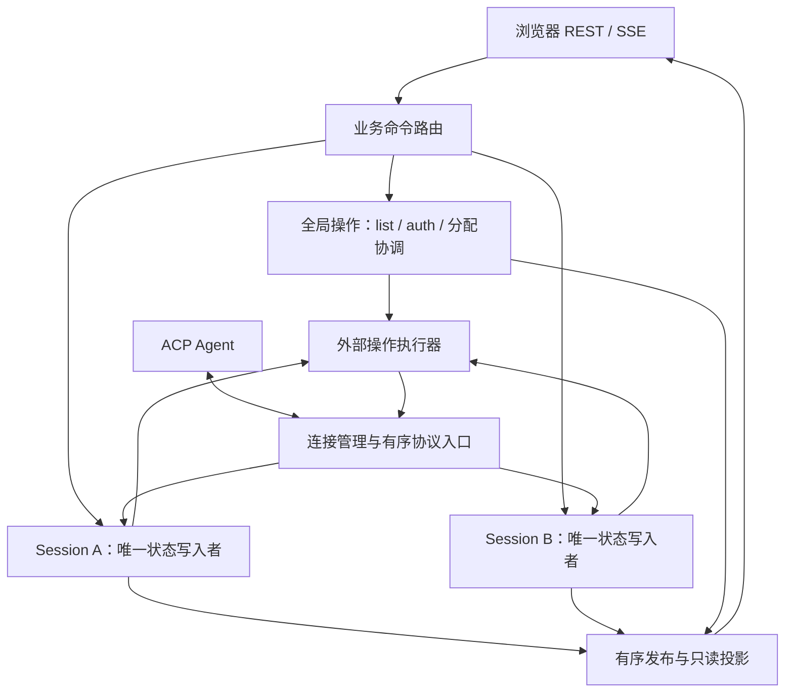

# Session 隔离与状态所有权重构讨论稿

状态：三个阶段已完成并通过验收，架构分层与验证结果见 [实施记录](session-isolation-implementation.md)。本文不替代 [现有运行态契约](active-turn-runtime.md) 和
[状态机测试要求](bridge-state-machine-tdd.md)。本轮讨论从权限／Elicitation 等待导致浏览器
重连 `session/list` 超时的问题出发；已经完成的回调等待修复应独立保留。

## 结论

建议推进重构，第一目标是让一个 session 只有一个权威状态转换入口，然后再把执行队列按
session 隔离。仅增加 actor 外壳，而保留现有多套可写状态，会扩大同步和回滚的复杂度。

目标边界是：连接层管理连接及路由，每个 session 管理自己的业务状态，Hub 管理派生视图和
有界订阅交付。状态转换与外部等待分开。一个 session 等待用户，不占用其他 session 或全局
操作的处理机会。

这不是进程或传输的硬隔离：所有 session 仍共享同一个 ACP 连接、Agent、进程和资源预算。
Agent 自身的串行行为、连接断开和总容量耗尽仍可能同时影响多个 session。

## 现状：已经存在 session 状态机，但所有权分散

| 现有部件 | 职责及重叠 |
| --- | --- |
| `BridgeState` | 用 `prompts`、`pending_*` 集合做准入；维护加载单飞、语义校验、真实交互 responder |
| `RuntimeState::SessionRuntime` | 生命周期、活动 turn、操作阶段、权限／表单／URL／终端，以及运行态 delta |
| `SessionMirror` | 历史 revision、CAS／幂等、活动 overlay、加载候选、完成后的历史提交 |
| `HistoryCache` | 不可变历史与候选的存储部件，应保留其独立分配，而非再建业务准入规则 |
| `BridgeHub` | 同时消费 canonical runtime 和旧事件流，维护两套派生投影及订阅 |

具体同步负担可以在 [bridge.rs](../src/bridge.rs) 中看到：

- `handle_command` 的 `session/prompt` 先执行 `SessionMirror::start_turn`，再做
  `reserve_session_operation`，再执行 `RuntimeState::start_prompt`；后续失败需要反向回滚。
- `handle_session_update` 把同一个活动更新写入 Mirror 和 Runtime，两边都有 overlay folding。
- `session_view_value` 合成两种表示时，需要删除 Runtime 的 `activeTurn`，使用 Mirror 的版本。
- 请求完成、关闭和取消需要同步业务状态、准入集合、真实 responder 和派生事件。

因此重构的主要收益是减少状态组合和一致性证明的负担。目前没有性能测量证明共享 Mutex
已经成为吞吐瓶颈；这次超时的直接原因是入站回调等待用户，而非已经证明的锁竞争问题。

## 建议的职责边界



图中箭头表示路由或提交关系，不表示在调用链内等待整个操作完成。具体 task 数量不由此图规定。

| 所有者 | 应拥有的状态与决策 |
| --- | --- |
| 连接层 | transport、初始化／能力／认证、epoch、RPC 路由、连接停止和全局预算 |
| 全局操作与 session 注册表 | `session/list` 元数据、session handle／incarnation、创建及 fork 的分配协调、ID 尚未返回时的有界暂存 |
| 单 session | 生命周期、准入矩阵、turn／CAS／幂等、历史提交、语义校验、本 session 的交互和资源归属、观察者缺席期限 |
| 请求作用域资源 | 没有 session ID 的 Elicitation／URL flow；保留在请求或连接作用域，不能借用当前页面的 session |
| 资源执行器 | ACP 请求、文件／终端／MCP I/O、取消与清理；通过归属标识回报结果 |
| Hub／发布层 | 已提交状态的只读投影、订阅队列、游标／reset、慢订阅者淘汰；不再次判断 session 的业务准入 |

MCP 连接等资源应按实际协议作用域管理，不能因为一次使用来自某个 session 就整体搬入该
session。终端和 URL 流也可能跨 turn 存活，不能在每次 turn 提交时全部清空。

## 一个权威所有者，不等于一个巨型状态枚举

建议先抽出逻辑上类似下面的聚合；这是职责示意，不是已定稿的 Rust 类型：

```text
SessionRuntime
├─ SessionState                    唯一业务状态
│  ├─ identity                     epoch + session ID + incarnation
│  ├─ lifecycle / workspace
│  ├─ history materialization / commit / failure state + handles / revisions / load attempt
│  ├─ active turn / overlay / outcome / idempotency
│  ├─ exclusive operation          control / attachment / fork / close / delete
│  ├─ interactions / resource ownership / semantic validation
│  └─ observation deadline / view revision
└─ ResourceHandles                 responder、取消句柄等非序列化运行资源
```

`SessionState` 的转换返回需要执行的外部操作和要发布的已提交变化；真正的 I/O 句柄由同一个
session 所有者管理，但不混入可序列化的状态和快照。完整历史仍独立分配，通过不可变引用共享。

生命周期、历史同步、运行中的 turn、独占控制操作和待回复交互是不同维度，应有统一的不变量，
但不应全部压成 `Idle / Busy / Waiting` 三种状态。例如：

- 一个 Running turn 可以同时等待 permission，并继续接收 update、view、respond、cancel。
- 当前契约允许 mode／config 或 close 与已有 prompt 共存；竞争的控制及生命周期操作仍互斥。
- 待确认交互并不一定意味着整个 session 没有其他进展；它也不是连接状态。
- 浏览器显示的 phase 可以从权威子状态派生，避免另外维护一组会漂移的 busy 标志。

历史的冷态、加载、提交中、失败阻塞及原因／history notice 必须有明确表示，不能仅根据
`active_turn` 或 `load_attempt` 是否存在来猜测，也不能用连接或 session 生命周期替代。

## 状态转换不能等待外部操作结束

```text
AppendTurn → 校验 revision / 幂等 / 准入 → 登记 turn → 发出 SendPrompt → 返回事件循环
PermissionReceived → 登记交互并发布 → 返回事件循环
RespondInteraction → 校验回复并发出 RespondRpc → 返回事件循环
PromptFinished → 校验归属 → 提交历史和下一 revision → 发布
```

上述操作都只占用短暂的状态转换时间。prompt、load、用户回复、终端退出及网络发送等待由
运行资源或外部任务承接。完成消息带回 epoch、incarnation、operation／attempt 身份，再由
状态所有者决定是否接纳。

不能将所有外部操作无序并行发送。尤其是 turn 刚被接受就收到 cancel 时，要么撤销尚未发送的
prompt，要么保证 prompt 已登记发送后再发送 cancel。取消请求也不能直接伪造原 prompt 已完成。

历史 folding 较大时也要控制单次调度时间；需要移交计算的步骤应保留不可变输入，并在结果
安装前检查归属和版本。不能为了拆 task 而丢失原子提交及历史共享的保证。

## 必须显式保留的顺序与一致性

1. **协议顺序。** 不同异步任务各自向同一个 FIFO mailbox 发送，并不自动等于 ACP 入站顺序。
   RPC 响应唤醒任务后才回投的 completion 可能落在后续 update 后面。协议入口需要统一登记
   notification、交互请求和响应完成的顺序，或使用经过验证的响应登记屏障；屏障只能等待短暂
   登记，不能等待 session 处理或用户。
2. **本地迟到结果。** 关闭、重开和重试后，旧 task、timer、responder 的结果必须被归属检查拒绝。
   ACP update 本身没有本地 incarnation，也没有 prompt/load 请求身份。本地标记不能识别 Agent
   在相同 ID 重开之后才发来的所有旧消息，更不能凭空推断每个 update 的 turn 归属。
3. **创建与 fork。** 在返回目标 ID 之前保留连接层分配预留和有界 early-update 路由。fork 源
   session 完成本地准入和不可变快照捕获，并保留 Fork 操作预留直至上游结果确定；其 actor
   继续处理允许的事件，不同步等待目标 actor。上游 fork 成功
   后，后续历史同步失败也不能触发重复 fork。
4. **观察切点。** `Observe(cursor, deliveryHandle)` 在 session 的一次转换中登记观察者、取消缺席
   期限并捕获 revision V 及对应的不可变视图或一致的 reset 字段。注册与其后该 session 的增量
   走同一有序 outbox，由发布层依次处理。actor 不等待 SSE 客户端消费；
   HTTP 取消或握手失败必须撤销临时观察者，不能永久阻止回收。
5. **全局序列。** 如保留聚合事件序列，应由发布层消费事件时统一分配。聚合快照只能来自它已经
   应用的发布前缀；不能并行读取各 actor 的最新状态，再随意附一个全局序号。每 session 的
   一致性与跨 session 原子事务是不同的保证，后者不是此设计目标。

当前 [server.rs](../src/server.rs) 的 session SSE 先登记订阅，再读取视图，并通过初始 reset
游标过滤队列中的旧 reset／delta；turn outcome 还依赖客户端的身份和版本判断，浏览器通过
GET 恢复视图。它不是字面意义上的一个 actor 调用。迁移时要
保留现有收敛行为，不能改成没有屏障的“先 GET、后订阅”。

## 隔离与容量的边界

入口不能因为某一个 session 的 mailbox 已满而无限 `await send`，否则又会阻塞全局消息处理。
建议有界队列按条数和字节记账，结合每 session 配额、全局预算和完成／取消事件的预留容量。
预留容量不等于允许历史提交跨过尚未处理的前序更新。
长 prompt 的在途请求配额也不能耗尽短全局 RPC、取消和交互回复的发送预算；仅保留 mailbox
空间不足以保证它们可被受理和发出。

- 尚未接受的浏览器新命令可以因容量不足直接拒绝。
- 已接受工作的必要 ACP 更新不能静默丢弃后继续展示完整、Ready 的状态。
- 慢浏览器的投影队列可以断开并重建；这与丢弃尚未应用的 Agent 更新是两种不同后果。
- 有限容量、无损接收和任意输入压力下永不阻塞不能同时保证。无法保序接纳时，必须明确标记
  不完整／不确定并采用受控故障策略；首版可沿用连接级故障域，不声称已有 session 级故障隔离。

具体队列容量、过载后的错误类型和关闭策略要在实现前定稿，并用确定性测试证明。单纯
`try_send` 后忽略错误，或为每条消息无限 spawn 等待任务，都不构成有界隔离。

## 浏览器恢复与全局发现应分开

[use-acp.ts](../web/src/lib/use-acp.ts) 的 `refreshRuntimeOnce` 当前先读取完所有 `session/list`
分页，才恢复路由指向的 session。后端对已 materialized 的 session 本来就可以直接提供视图。

建议让已知 session 的 GET／SSE 恢复和列表刷新各自推进；列表失败不应单独把仍可读取的会话
标记为连接断开。对于冷启动且不带 cwd 的裸 session URL，仍要完成目录／工作区解析，不能
把元数据发现完成前的本地未命中直接当成最终不存在。

全局 `/api/v1/events` 当前还复用聚合订阅，先接收 session 相关内容，再在 HTTP 层过滤。
应在发布前按作用域路由，让连接／认证订阅免受无关 session 输出的队列压力。兼容与调试
聚合流如果仍需保留，应单独标识其用途。现有 REST/SSE 业务格式可以保留。

## 迁移顺序和完成条件

| 阶段 | 工作 | 完成条件 |
| --- | --- | --- |
| 1：收敛所有权 | 抽出 session 聚合与唯一转换入口；暂留原共享锁作为迁移手段 | 删除 `BridgeState` 的 session 级 `prompts/pending_*` 镜像准入、第二份权威活动 overlay 和对应回滚；派生投影不参与业务决策 |
| 2：隔离执行 | 每 session 有序队列；外部操作及结果回投；连接层保留全局注册与路由 | 全局命令循环和协议入口不等待单 session 的外部操作；证明顺序、取消、队列和迟到结果规则 |
| 3：收敛观察 | session 提交驱动 Hub；明确 Observe 切点；拆全局订阅和会话恢复的列表依赖 | Hub 不推断业务生命周期；只读投影、订阅计数和定时器事件各有明确所有者；业务 API 行为兼容 |

阶段 1 仍然使用共享锁时，不能宣称已经完成多 session 执行隔离。浏览器恢复与列表解耦是一个
较小且独立的改善，可以提前实施，不必等所有 Rust 模块迁移结束。
删除镜像状态不包括全局 create／fork 分配预留、request ID 路由、加载 attempt、真实资源句柄
以及只读投影所需的表示。

建议用以下行为证明迁移，而非用“已经有 actor 类型”判断完成：

- A 等待 permission／elicitation 时，list、B 的 prompt、A 的查询／回复／取消都能推进。
- A 的 control 或 close 与 prompt 按原有准入矩阵共存；重复 prompt 不越过 CAS。
- 响应紧跟最后一个 update、update 紧跟响应时，历史和 turn 边界顺序一致。
- Append 紧接 Cancel 不会出现 cancel 先发、prompt 后发而继续运行。
- 关闭后同 ID 重开，旧本地 completion／timer 不污染新 incarnation。
- 冷加载的并发观察仍只触发一次加载；重连 Running／Reconciling 执行零次 load。
- 订阅与提交交错时，无缺口、无混合历史；取消握手不泄漏观察者。
- 一个 mailbox 或慢浏览器达到上限时，预算、保序和可见失败符合约定。
- 关键桥接用例覆盖 stdio、HTTP/SSE、WebSocket；浏览器只验证投影与用户路径。

## 本轮讨论中的取舍

状态所有权审查倾向先使用纯转换入口，暂不要求每 session 独立 Tokio task；并发审查认为独立
队列有价值，但强调队列本身不能解决顺序、取消和背压；观察者审查指出只拆 Rust 执行层仍会
留下浏览器和全局订阅的依赖。综合建议是保留三者的收益，按上面的顺序迁移。

先不引入每 session 独立 ACP 连接、数据库、持久化 mailbox、跨 session 事务或新的浏览器协议。
这些都不是解决当前所有权与等待耦合所必需的条件，也涉及不同的兼容性和产品取舍。
